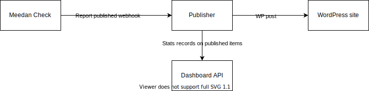
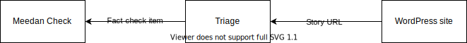
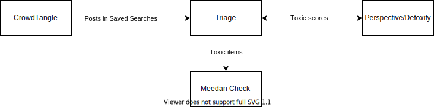
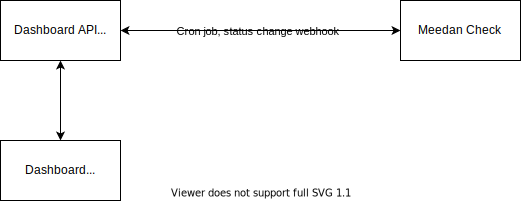

## **Index**
* [**Solution**](#solution)
* [**Technical Overview**](#overview)
* [**Components**](#components)
* [**Functionalities**](#funcs)
* [**Deployment**](#installation)
	* [Pre-requisites](#prereq)
	* [Environment variables](#envs)
	* [Installation and development ](#inst_dev)
	* [Deployment ](#deploy)
* [**API reference**](#api_ref)
* [**Release notes**](#rel_notes) 
* [**Support**](#support)

## **Solution** 
IVerify processes articles and outputs reports with a determination of their veracity. The inputs are either manual, by members of the public or the iVerify team, or automated. People can submit articles for review via text (WhatsApp, SMS, and more) or directly through the iVerify platform. Leveraging CrowdTangle, which allows iVerify to track public content across social media, iVerify also automatically reviews articles in Facebook, Instagram, and Reddit daily, running them through Detoxify, an open-source algorithm which uses machine learning to detect hate speech. 

These reports are then sent to the team of in-person fact-checkers, composed of individuals linked to one or several national counterparts that have been capacitated and equipped through the iVerify’s initiative. As part of their fact-checking assignment, the team follows up with the people or institutions mentioned in a story to determine the veracity of the claims made. If those in-person verifiers find hate speech, disinformation, or misinformation, they flag it and publish an article on the iVerify website to let the world know. iVerify leverages open-source technology, Meedan Check, to help. It uses human-in-the-loop machine learning to match content so that anything already labeled false doesn't have to be reviewed again, improving efficiency. All these tools and approaches are open and available to anyone to use.

The idea is a set of integrations built around the Meedan Check platform, providing additional features to facilitate the fact-checking process and the dissemination of fact-checked stories to the public.

The solution is currently using CrowdTangle, a public tool from Meta that allows collecting of posted content and based on specified set of filters and how it is being shared. The collected information is then processed through an AI open-source algorithm called Detoxify , to get an indicator on toxicity. Human fact-checkers will access Meedan and review the information to contrast and validate it finally, indicate if it is valid or fake news. The publishing process use a WordPress site that receives the reviewed and categorized information for the public user. 

## **Technical Overview** 

The solution comprises of 5 custom components (iVerify Dashboard, WordPress website, Dashboard API, Publisher bot, Triage bot) plus 3 external components integrated in the solution (Meedan Check, CrowdTangle, Perspective/Detoxify). Each custom component is deployed as an independent application within a dedicated Docker container. These are
*	The WordPress website container
*	The iVerify Dashboard container
*	The Dashboard API container
*	The Publisher bot container
*	The Triage bot container

**This repository**,iVerifyApps is the set of [Node.js](https://nodejs.org/en/) apps responsible for the integration and data analytics layers in the iVerify toolset to be used in addressing information pollution (misinformation) and hate speech nationally.

For the **portal** component please visit [IVerify Website](https://github.com/undp/iVerify-Website).

## **Components** 
 
There are 4 different apps, conveniently held in a single [Nrwl/Nx](https://nx.dev/getting-started/intro) monorepo:
 
*  **api**: the backend for the Dashboard, build with [Nest.js](https://nestjs.com/)
*  **iverify**: the frontend for the Dashboard, built with [Angular](https://angular.io/)
*  **publisher**: a backend app built with [Nest.js](https://nestjs.com/) responsible for publishing data externally (primarily on WordPress)
*  **triage**: a backend app built with [Nest.js](https://nestjs.com/) responsible for the triage of toxic social media content 

Additionally, a **MySql database** is required for persistence.

## **Main functionalities** 

**Integration features:**

The system integrates with the fact-checking portal [Meedan Check](https://meedan.com/check) and provides extra channels for both the publication of fact-checking reports and the tipline for incoming stories. Additionally, the system provides a triaging workflow of toxic social media content by integrating [CrowdTangle](https://www.crowdtangle.com/), Detoxify/[Perspective](https://www.perspectiveapi.com/) and Meedan Check.
	
* **Meedan Check - WordPress:**
	  

	* Publication on WordPress of Meedan Check reports:
		  

		When a fact-checking report is published in Meedan Check, a webhook triggers the publication of a corresponding article on a WordPress site.
		  
	

		

	  

	* Creation of Meedan Check items from WordPress (story suggestion):
		  

		The WordPress site can also serve as a tipline source for Meedan Check. The public can submit a url for a story to fact-check and a corresponding fact-checking item will be created on Meedan Check. 
	  

		

	  

* **CrowdTangle - Detoxify/Perspective - Meedan Check:**
	  

	* Based on CrowdTangle saved searches, the Triage app scans social media content, analyzes it for toxicity using either Detotify or Perspective and finally creates items on Meedan Check if toxicity levels are above the user defined treshold.
	  

		

**Data Analytics:**

The Dashboard front-end offers data visualizations of several indicators giving a pulse of the fact-checking and publication activity. This is achieved by a combination of scheduled jobs that interrogate the Meedan Check DB and webhooks that receive data from Check when something happens (e.g. when an item has changed state Check will notify the **api** server so that it can calculate ticket response and resolution velocity).
  

  

## **Deployment** 

**Pre-requisites** 

* A working instance of Meedan Check
* Meedan check folders and annotation structure as per the Iverify Standard.
* On Meedan Check, there must be webhooks configured to hit these endpoints:
	*  Event `report_published` sends data to the endpoint:  `PUBLISHER_URL/publish/publish-webhook`
	*  Event `update_annotation_verification_status` sends data to the endpoint:  `API_URL/stats/item-status-changed`

* Both endpoints receive a minimum payload containing the dbid of the item that triggered the event. iVerifyApps will subsequently fetch the additional data it needs from Meedan Check. Instructions for how to set up a webhook (or *bot*) are on the [Check Wiki](https://github.com/meedan/check/wiki/Create-Bots-on-Check)
* A WordPress website with [Advanced Custom Fields](https://www.advancedcustomfields.com/) plugin enabled (see [iVerifyWebSite](https://github.com/undp/iVerify-Website) for detailed instructions on how to set up the WordPress site)

* A [CrowdTangle](https://www.crowdtangle.com/) account with Saved Searches and an API token
* A Perspective API Key [Perspective](https://perspectiveapi.com/)

**Environment variables**

The apps need a number of environment variables that can be stored in a single `.env` file at the root of the project. This is the list of the variables needed:

- `CHECK_API_URL`: URL of the Meedan Check instance
- `CHECK_API_TOKEN`: Meedan Check authentication token
- `CHECK_API_TEAM`: Meedan Check team's slug
- `CHECK_FOLDER_ID`: ID of the Meedan Check folder where items from CrowdTangle are loaded
- `CHECK_TIPLINE_FOLDER_ID`: ID of the Meedan Check folder for items from WordPress tipline
- `WP_SECRET`: secret token for the authentication of iVerify WordPress on Triage
- `WP_URL`: url of iVerify WordPress
- `WP_USERNAME`: login for iVerify WordPress REST API
- `WP_PASSWORD`: login for iVerify WordPress REST API
- `WP_PUBLISHED_FOLDER`: ID of the Meedan Check folder where published items are moved to
- `CT_API_URL`: CrowdTangle API URL
- `CT_API_KEY`: CrowdTangle authentication token
- `ML_SERVICE_API_BASE`: base URL of the Detoxify server
- `DETOXIFY_TRESHOLD`: toxicity cutoff
- `DB_USER`: Database credentials
- `DB_PORT`: Database credentials
- `DB_HOST`: Database credentials
- `DB_NAME`: Database credentials
- `DB_PASSWORD`: Database credentials
- `language`: language ('en' or 'es')
- `VIOLATION_TASK_ID`: ID for task 'Violation Type' on Meedan Check
- `UNSTARTED_VALUE`: 'value' property of validation statuses on Meedan Check
- `IN_PROGRESS_VALUE`: 'value' property of validation statuses on Meedan Check
- `FALSE_VALUE`: 'value' property of validation statuses on Meedan Check
- `TRUE_VALUE`: 'value' property of validation statuses on Meedan Check
- `MISLEADING_VALUE`: 'value' property of validation statuses on Meedan Check
- `OUT_OF_SCOPE_VALUE`: 'value' property of validation statuses on Meedan Check
- `PARTLY_FALSE_VALUE`: 'value' property of validation statuses on Meedan Check
- `INCONCLUSIVE_VALUE`: 'value' property of validation statuses on Meedan Check
- `PRE_CHECKED_VALUE`: 'value' property of validation statuses on Meedan Check
- `API_URL`: base url of the Dashboard API
- `JWT_SECRET`: secrets for Dashboard authentication through iVerify WordPress
- `WT_SECRET_TOKEN`: secrets for Dashboard authentication through iVerify WordPress
- `CLIENT_ID`: secrets for Dashboard authentication through iVerify WordPress
- `CLIENT_SECRET`: secrets for Dashboard authentication through iVerify WordPress
- `REDIRECT_URI`: secrets for Dashboard authentication through iVerify WordPress. 

**Installation and development** 

* To install dependencies: `npm i`
* To run **api** locally: `npx nx serve api` 
* To run **iverify** locally: `npx nx serve iverify`
* To run **publisher** locally: `npx nx serve publisher`
* To run **triage** locally: `npx nx serve triage`

**Deployment** 

All the apps need to be built before deployment. The build command is:

* npx nx build APP_NAME –configuration=production

The ‘configuration’ flag represents additional configuration parameters that can be specified in the environments folder in each application. 

After the build, the application bundle can be found in the dist/APP_NAME folder.

This procedure can be automated using Docker and the repository includes a docker-compose.prod.yml file and app specific Dockerfile-prod files for each application. These can be customized to reflect the new deployment environment.

## **Api reference** 

All backend apps have Swagger. To access the API docs go to APP_URL/api.

## **Release notes** 
* v1.0: Zambia
* v2.0: Honduras
* v3.0: Kenya

## **Governance and Support** 
 With funding, coordination and support from [United Nations Development Programme](https://www.undp.org)

UNDP is responsible for managing the application. 

Availability problems, failures of platform components, capacity requirements, performances degradation, database indexing, backup and monitoring are all in the responsibility of UNDP.

UNDP is also responsible for performing the user support.

By performing such support UNDP may require assistance from [UNICC](https://www.unicc.org). 

